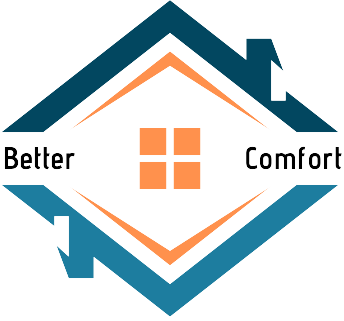

# 🏨 BetterComfort

<p align="center">
  
</p>

<p align="center">
  <strong>A modern, geolocation-driven hotel and dining discovery platform built with Django 5.</strong>
</p>

<p align="center">
  
  
  
  
  
  
  
</p>

---

## 📖 Overview

**BetterComfort** is a full-featured web application designed to help travelers and food lovers discover nearby accommodations and restaurants seamlessly. Combining device geolocation, local database records, and external geospatial APIs (Geoapify Places API), BetterComfort enables users to find nearby stays, explore interactive maps, read authentic reviews, save favorites, and book reservations instantly.

---

## 👤 Author

**Samir Adhikari**  
*BCA, Tribhuvan University*  
GitHub: [@Samir-021](https://github.com/Samir-021)


---

## ✨ Key Features

- 📍 **Live Geolocation Search**: Automatically detects user GPS coordinates (with intelligent fallbacks) and searches for nearby hotels and restaurants within an adaptive radius (5 km up to 20 km).
- 🔍 **Fuzzy Search with RapidFuzz**: Misspellings and partial search queries are matched gracefully using Levenshtein distance scoring.
- 🗺️ **Interactive Maps with Leaflet & OSM**: Displays user location alongside hotel coordinates on dynamic OpenStreetMap tiles.
- ⭐ **Ratings & Review System**: Authenticated users can rate stays (1–5 stars) and post detailed reviews; average scores update dynamically.
- ❤️ **Saved Favorites**: One-click bookmarking for quick access to preferred destinations.
- 📅 **Direct Booking Management**: Reserve rooms with custom check-in/check-out dates and guest counts, with a dedicated "My Bookings" management dashboard.
- 🔒 **User Isolation & Security**: CSRF protection, secure password hashing, ownership checks on reservation deletions, and protected authenticated views.
- 🛠️ **Custom Admin Portal**: Tailored Django administration with custom headers, model listings, and search filters.

---

## 🏗️ Architecture & Tech Stack

| Layer | Technology |
|---|---|
| **Backend Framework** | [Django 5.1](https://www.djangoproject.com/) (Python 3.12) |
| **Python Package** | `bettercomfort` (PEP 8 standard lowercase package) |
| **Database** | [SQLite3](https://www.sqlite.org/) (Development & Single-Node Production) |
| **Geospatial & Geodesic** | [geopy](https://geopy.readthedocs.io/) & [Geoapify Places API](https://www.geoapify.com/) |
| **Fuzzy Matching** | [RapidFuzz](https://github.com/rapidfuzz/RapidFuzz) |
| **Frontend UI** | HTML5, Vanilla CSS3, [Bootstrap 5](https://getbootstrap.com/), [Swiper.js](https://swiperjs.com/) |
| **Mapping Engine** | [Leaflet.js](https://leafletjs.com/) with OpenStreetMap |
| **Config & Secrets** | [python-dotenv](https://github.com/theskumar/python-dotenv) |

---

## 🗂️ Project Structure

```text
BetterComfort_Project/
├── .env.example               # Environment variables template (BETTERCOMFORT_*)
├── .gitignore                 # Standard Python/Django ignore rules
├── README.md                  # Comprehensive documentation
├── requirements.txt           # Pinned production & dev dependencies
├── run.bat                    # Quick launcher for Windows
│
└── BetterComfort/             # Main Django project root
    ├── manage.py              # Self-healing Django management script (auto-detects .venv)
    ├── run.bat                # Directory launcher
    ├── db.sqlite3             # SQLite database
    ├── schema.png             # Entity-Relationship diagram
    ├── schema.dot             # Graphviz schema model
    │
    ├── bettercomfort/         # Python/Django configuration package (PEP 8)
    │   ├── __init__.py
    │   ├── asgi.py            # ASGI application entrypoint
    │   ├── settings.py        # Project settings with dotenv support
    │   ├── urls.py            # Top-level URL routing
    │   └── wsgi.py            # WSGI application entrypoint
    │
    ├── hotels/                # Core accommodation & booking application
    │   ├── admin.py           # Django admin registrations
    │   ├── apps.py            # App configuration
    │   ├── converters.py      # FloatConverter for coordinate URL routing
    │   ├── forms.py           # ReviewForm and BookingForm
    │   ├── models.py          # HotelRestro, FavoriteHotel, Review, Booking
    │   ├── tests.py           # Automated unit and integration tests
    │   ├── urls.py            # App URL dispatcher
    │   ├── views.py           # Views and search/booking logic
    │   ├── migrations/        # Database migration history (0001 - 0022)
    │   └── templates/hotels/  # App templates (home, search, details, etc.)
    │
    ├── statics/               # Static assets
    │   ├── css/               # style.css and responsive-style.css
    │   ├── images/            # Logo, hero sliders, branding
    │   └── js/                # main.js (Geolocation, Swiper, UI hooks)
    │
    └── templates/             # Project-level base templates
        └── main.html          # Base layout template with navigation & footer
```

---

## 🚀 Quickstart Installation Guide

Follow these steps to run BetterComfort locally on Windows, macOS, or Linux.

### 1. Prerequisites
- **Python 3.10 or newer** (`python --version`)
- **Git** (`git --version`)

### 2. Clone the Repository
```bash
git clone https://github.com/Samir-021/BetterComfort.git
cd BetterComfort
```

### 3. Create and Activate a Virtual Environment

**Windows (PowerShell):**
```powershell
python -m venv .venv
.\.venv\Scripts\Activate.ps1
```

**Windows (Command Prompt):**
```cmd
python -m venv .venv
.\.venv\Scripts\activate.bat
```

**macOS / Linux:**
```bash
python3 -m venv .venv
source .venv/bin/activate
```

### 4. Install Dependencies
```bash
pip install --upgrade pip
pip install -r requirements.txt
```

### 5. Configure Environment Variables
Copy the `.env.example` file to create your own `.env`:

```bash
# On Windows PowerShell:
Copy-Item .env.example .env

# On Linux/macOS:
cp .env.example .env
```

Open `.env` and verify the settings. A working Geoapify development key is provided by default.

### 6. Apply Database Migrations
The repository comes pre-loaded with initial migration files. Run:
```bash
cd BetterComfort
python manage.py migrate
```

### 7. (Optional) Create a Superuser
To access the Django Admin Portal:
```bash
python manage.py createsuperuser
```

### 8. Run the Development Server
```bash
python manage.py runserver
```
Or simply execute the launcher on Windows:
```powershell
.\run.bat
```

Visit **[http://127.0.0.1:8000/](http://127.0.0.1:8000/)** in your browser.

---

## 🔑 Environment Variables Reference

All variables use the `BETTERCOMFORT_*` prefix:

| Variable | Description | Default / Example |
|---|---|---|
| `BETTERCOMFORT_SECRET_KEY` | Django cryptographic secret key | Secure random string |
| `BETTERCOMFORT_DEBUG` | Enables/disables debug mode | `True` for dev, `False` for prod |
| `BETTERCOMFORT_ALLOWED_HOSTS` | Comma-separated list of allowed hostnames | `127.0.0.1,localhost` |
| `BETTERCOMFORT_GEOAPIFY_API_KEY` | API key from [Geoapify](https://www.geoapify.com/) for Places search | `d9e349a2...` |

*(Note: Standard non-prefixed variables such as `SECRET_KEY`, `DEBUG`, etc., are also supported as fallbacks).*

---

## 🧪 Running Automated Tests

BetterComfort includes a complete suite of unit and integration tests covering models, float URL converters, authentication, view endpoints, user authorization, and search fallbacks.

To run all tests:
```bash
cd BetterComfort
python manage.py test
```

Verbose test output:
```bash
python manage.py test -v 2
```

---

## 🗺️ How Search & Geolocation Works

1. **Client Geolocation**: When a user visits the site, `navigator.geolocation` queries the browser for coordinates with high accuracy. If denied or unavailable, it defaults to city coordinates.
2. **Hybrid Discovery Engine**:
   - Queries local database (`HotelRestro`) using geodesic distance calculations within the user's radius.
   - Concurrently queries the Geoapify API in concentric circles (5km, 10km, 15km, 20km) until at least 5 unique places are discovered.
3. **Fuzzy String Matching**: When a keyword query `q` is supplied, `rapidfuzz.process.extract` ranks matches with partial ratio scoring so typos (e.g. *"Marriot"* vs *"Marriott"*) still return accurate results.
4. **Interactive Pinning**: Results link to individual detail pages featuring dynamic Leaflet maps showing both the user marker and the hotel location.

---

## 📊 Database Schema

An Entity-Relationship diagram is stored in `BetterComfort/schema.png`.

- **`HotelRestro`**: Stores hotel name, address, phone number, and GPS coordinates (latitude [-90, 90], longitude [-180, 180]).
- **`FavoriteHotel`**: Links users to saved hotels with quick access metadata.
- **`Review`**: Connects a `User` to a `HotelRestro` with a rating (1 to 5) and review text.
- **`Booking`**: Records guest check-in/out dates, guest counts (adults, children), and user association.

---

## 📈 Future Roadmap

- 💳 Online payment gateway integration
- 🍽️ Restaurant table reservation system
- 🏨 Interactive room selection and room-type tiering
- 📸 Guest photo uploads for reviews
- ⚡ Real-time hotel pricing and dynamic availability feeds

---

## ❓ Troubleshooting FAQ

### 1. "Permission to access location was denied"
- Make sure your browser has granted location access to `http://127.0.0.1:8000/`.
- If blocked, BetterComfort will automatically use default fallback coordinates so search features remain fully functional.

### 2. "Application labels aren't unique, duplicates: admin"
- This occurred previously when both `material.admin` and `django.contrib.admin` were installed simultaneously. The project has been refactored to use standard, stable `django.contrib.admin`.

### 3. "No module named 'bettercomfort' or 'django'"
- `manage.py` has been enhanced with automatic virtualenv detection. When run with any python interpreter, it automatically detects and bridges to your local `.venv`.

---

## 📄 License

This project is licensed under the **MIT License**.
